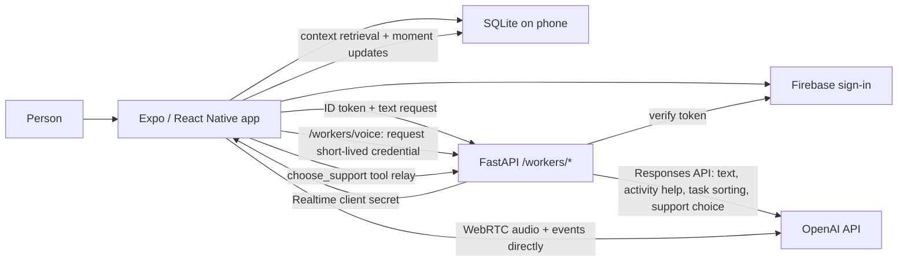

```mermaid
flowchart LR
  Person --> App["Expo / React Native app"]
  App --> Auth["Firebase sign-in"]
  App --> Local["SQLite on phone"]
  App -->|"ID token + text request"| API["FastAPI /workers/*"]
  API -->|"verify token"| Auth
  API -->|"Responses API: text, activity help, task sorting, support choice"| OpenAI["OpenAI API"]
  App -->|"/workers/voice: request short-lived credential"| API
  API -->|"Realtime client secret"| App
  App -->|"WebRTC audio + events directly"| OpenAI
  App -->|"choose_support tool relay"| API
  App -->|"context retrieval + moment updates"| Local
```